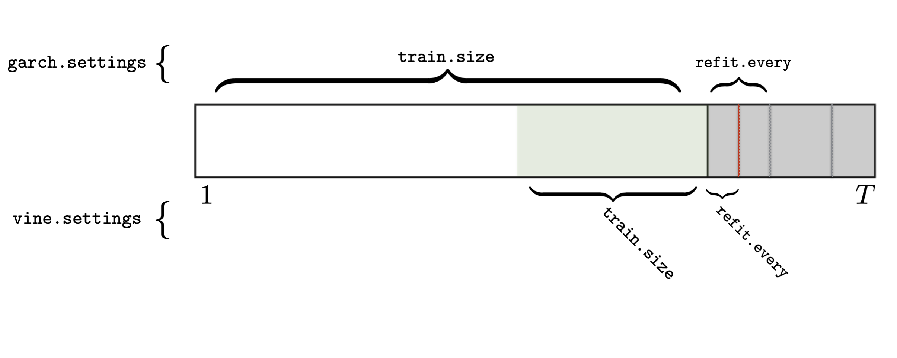

### Installation
The installation is best described through an example:
* Assuming your R script is located in `/dir/my-script.R`
* CLone the project into some directory `/another-dir/VaRVine`

* Now, in your `/dir/my-script.R`, run the following to install the package:
```
setwd(/another-dir)
library(devtools)
install("VaRVine")
library(VaRVine)
```
* Now, the package is loaded into your `/dir/my-script.R` and can be used.

### Usage
```
library(VaRVine)
library(rugarch)

data("sample_returns")
garch.specs <- list(
  GOOG = ugarchspec (
    variance.model = list(garchOrder = c(1, 1)),
    mean.model = list(armaOrder = c(1, 1)),
    distribution.model = "norm"),
  AMZN = ugarchspec (
    variance.model = list(garchOrder = c(1, 1)),
    mean.model = list(armaOrder = c(1, 1)),
    distribution.model = "sged")
)
garch.settings <- garch_settings(train.size = 750, refit.every = 50)
vine.setttings <- vine_settings(train.size = 250, refit.every = 25, family.set = 'all')
roll <- garch_vine_roll(sample_returns, garch.settings,
                      vine.settings, alpha=0.05, weights=c(0.5, 0.2, 0.3))
head(roll@VaR.forecast)
```

### Parameter visualization
